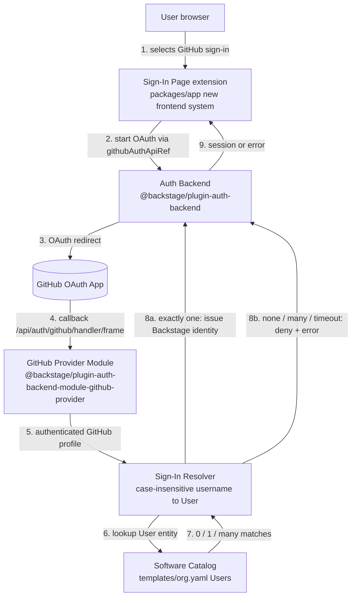

# Design Document

## Overview

This feature adds GitHub OAuth sign-in to the Backstage application, alongside the existing
guest provider. It spans four concerns:

1. **Backend provider registration** — register the GitHub authentication provider module with
   the Auth Backend so the backend can process GitHub OAuth requests. (Requirement 1)
2. **Configuration** — declare a `github` provider block (with environment-referenced
   credentials) under `auth.providers` in both `app-config.yaml` (development) and
   `app-config.production.yaml` (production), and select the active `auth.environment`.
   (Requirement 2)
3. **Sign-in resolution** — configure a sign-in resolver that maps an authenticated GitHub
   username to a catalog `User` entity, denying sign-in when there is no matching entity.
   (Requirement 3)
4. **Frontend sign-in surface** — present GitHub as a selectable sign-in option on the sign-in
   page in the declarative (new) frontend system, and document the two new environment variables
   in the README. (Requirements 4 and 5)

The heart of the feature is small: it is mostly declarative Backstage configuration plus one
backend registration line, with the only non-trivial *logic* living in the sign-in resolver
(GitHub username → catalog `User`). That distinction drives the testing strategy: the resolver's
matching behavior is unit- and property-testable, while the config/registration parts are
verified by config-shape assertions and startup/integration checks.

### Research summary and key findings

The design is grounded in the current package versions in this repo:

- `@backstage/plugin-auth-backend@^0.30.0`
- `@backstage/plugin-auth-backend-module-github-provider@^0.5.6` (already a dependency in
  `packages/backend/package.json`, but **not yet registered** in
  `packages/backend/src/index.ts`)
- `@backstage/plugin-auth-node@^0.7.4`
- Frontend: `@backstage/frontend-defaults@^0.5.5`, `@backstage/frontend-plugin-api@^0.18.0`,
  `@backstage/plugin-auth@^0.1.11` (the app uses the **new declarative frontend system**)

Findings that shaped the design (sourced from the official Backstage docs, rephrased for
compliance with licensing restrictions):

- **Config-based sign-in resolvers.** The GitHub provider supports built-in resolvers selected
  purely via `app-config` under `auth.providers.github.<env>.signIn.resolvers`, with no code
  required. The relevant built-in is `usernameMatchingUserEntityName`, which maps the GitHub
  username to a catalog `User` entity of the same `metadata.name`.
  ([Sign-in identities and resolvers](https://backstage.io/docs/auth/identity-resolver/),
  [GitHub provider](https://backstage.io/docs/auth/github/provider))
- **Deny-on-no-match is built in.** The built-in GitHub resolvers throw a `NotFoundError` when no
  matching `User` entity is found; resolvers are tried in order and only skipped on
  `NotFoundError`. This directly supports Requirement 3.3 (deny when no match) without custom
  code. ([GitHub provider](https://backstage.io/docs/auth/github/provider))
- **Callback URL.** For local development the GitHub OAuth App's Authorization callback URL is
  `http://localhost:7007/api/auth/github/handler/frame` and the Homepage URL is
  `http://localhost:3000`; the callback path is derived from the backend `baseUrl`.
  ([GitHub provider](https://backstage.io/docs/auth/github/provider))
- **New frontend system sign-in page.** In the declarative frontend system used here
  (`createApp` from `@backstage/frontend-defaults` with a `features` array), the sign-in page is
  supplied as a `SignInPage` frontend extension bundled into a frontend module — the same
  `createFrontendModule(...)` pattern already used by `navModule` and `homeModule` in
  `packages/app/src/modules`. It is **not** wired through `App.tsx` routing the way the legacy
  frontend system did.
  ([Building apps](https://backstage.io/docs/frontend-system/building-apps/index),
  [Enabling a public entry point](https://backstage.io/docs/tutorials/enable-public-entry/))

**Design decision — built-in resolver vs. custom resolver.** Requirement 3.2 requires
*case-insensitive* matching of GitHub username to `User` entity name, and Requirements 3.4 and
3.5 require explicit, distinct denials for the *ambiguous* (multiple-match) and
*catalog-unreachable* cases. The built-in `usernameMatchingUserEntityName` resolver matches on
exact entity name and relies on catalog name-uniqueness; it does not, on its own, guarantee
case-insensitive lookup or emit the specific ambiguity/timeout error semantics the requirements
call for. Therefore this design specifies a **custom sign-in resolver** (constructed in
`packages/backend/src/index.ts` using `createOAuthProviderFactory` + `githubAuthenticator` from
the same provider package) that:

- performs a **case-insensitive** match of the GitHub username against catalog `User` entity
  names,
- issues an identity only when exactly one matches,
- denies with a distinct error for zero matches, more-than-one match, and catalog-lookup
  timeout (bounded at 10 seconds per Requirement 3.5).

The built-in `usernameMatchingUserEntityName` resolver is documented in the config as the
fallback/simple option, but the primary path implements the custom resolver to satisfy the full
Requirement 3 behavior. When a custom resolver is registered in code, the `app-config`
`signIn.resolvers` list must be omitted for that provider (config resolvers take priority over
the code resolver), so the design keeps the resolver decision in exactly one place.

## Architecture



### Component responsibilities

| Layer | Component | Responsibility | Requirements |
| --- | --- | --- | --- |
| Backend | `@backstage/plugin-auth-backend` | Hosts auth providers; exposes provider endpoints | 1.3 |
| Backend | GitHub provider module registration in `index.ts` | Registers the GitHub OAuth provider with the Auth Backend | 1.1, 1.2 |
| Backend | Custom sign-in resolver (in `index.ts`) | Maps GitHub username → catalog `User`; enforces deny semantics | 3.1–3.5 |
| Config | `app-config.yaml` (development env block) | GitHub `clientId`/`clientSecret` env references; resolver selection | 2.1–2.5 |
| Config | `app-config.production.yaml` (production env block) | Same, under a `production` key | 2.6 |
| Frontend | `SignInPage` extension / sign-in frontend module | Presents GitHub as a selectable sign-in option; starts OAuth | 4.1–4.5 |
| Docs | README Environment variables table + note | Documents `GITHUB_CLIENT_ID` / `GITHUB_CLIENT_SECRET` | 5.1–5.4 |

### Auth environment selection

`auth.environment` in `app-config` selects which nested provider block is active (`development`
or `production`). Local dev uses `development` (added to `app-config.yaml`); production overrides
set `production` (added to `app-config.production.yaml`, which is merged on top of the base
config). Because config files are merged with later files overriding earlier ones, the
production file sets `auth.environment: production` and its own `auth.providers.github.production`
block.

### Failure and startup behavior

- If `GITHUB_CLIENT_ID` or `GITHUB_CLIENT_SECRET` is unset, the `${...}` reference cannot be
  resolved and the Auth Backend surfaces a configuration error rather than starting the GitHub
  provider with empty credentials (Requirements 1.4, 2.7). This is Backstage's standard config
  resolution behavior for unresolved environment references used by a configured provider.
- The guest provider registration and its `auth.providers.guest` block are retained unchanged, so
  guest sign-in continues to work in parallel (Requirements 1.2, 2.5).

## Components and Interfaces

### 1. Backend registration (`packages/backend/src/index.ts`)

Current state (verified): the file registers `@backstage/plugin-auth-backend` and
`@backstage/plugin-auth-backend-module-guest-provider`, and does **not** yet register the GitHub
provider module.

Two registration approaches, chosen by whether a custom resolver is needed:

**Approach A — built-in resolver only (config-driven).** Add a single import next to the guest
provider; the resolver is chosen entirely in `app-config`:

```typescript
// auth plugin
backend.add(import('@backstage/plugin-auth-backend'));
backend.add(import('@backstage/plugin-auth-backend-module-guest-provider'));
backend.add(import('@backstage/plugin-auth-backend-module-github-provider')); // added
```

**Approach B — custom resolver (this design's primary path, for full R3 semantics).** Register a
custom backend module that builds the GitHub provider with a code-defined sign-in resolver, using
`githubAuthenticator` and `createOAuthProviderFactory` from `@backstage/plugin-auth-node` /
the provider package. The custom module targets `pluginId: 'auth'`, `providerId: 'github'`, and
supplies a `signInResolver(info, ctx)` that implements case-insensitive matching and the three
deny cases. When Approach B is used, `signIn.resolvers` is omitted from the GitHub provider's
`app-config` block.

The guest provider registration line is retained in both approaches (Requirement 1.2).

### 2. Sign-in resolver interface

The resolver receives the successful GitHub sign-in result (`info`, containing the GitHub profile
including the username) and a context (`ctx`) exposing catalog lookup and token-issuance helpers.

Resolver contract:

| Input condition | Behavior | Requirement |
| --- | --- | --- |
| Exactly one `User` entity whose `metadata.name` equals the GitHub username under case-insensitive comparison | Issue a Backstage identity for that entity | 3.2 |
| No matching `User` entity | Deny; issue no identity/session; error "no matching catalog User entity" | 3.3 |
| More than one matching `User` entity | Deny; issue no identity/session; error "ambiguous GitHub identity" | 3.4 |
| Catalog lookup does not complete within 10 seconds | Deny; issue no identity/session; error "identity could not be resolved" | 3.5 |

The resolver is a pure decision function over `(githubUsername, candidateUserEntities)` plus a
bounded catalog call. The matching decision (the part that varies with input) is factored into a
pure helper so it can be property-tested independently of the catalog and token machinery:

```typescript
type ResolveOutcome =
  | { kind: 'match'; userRef: string }
  | { kind: 'no-match' }
  | { kind: 'ambiguous'; count: number };

// Pure: decides the outcome from the username and the candidate entity names.
function resolveGithubUser(
  githubUsername: string,
  candidateUserEntityNames: string[],
): ResolveOutcome;
```

`resolveGithubUser` lowercases both sides for comparison and counts matches; the surrounding
resolver wires it to the catalog query (bounded by a 10s timeout) and to `ctx` token issuance,
translating each `ResolveOutcome` (and the timeout) into either an issued identity or a specific
denial error.

### 3. Configuration interface

`app-config.yaml` (development):

```yaml
auth:
  environment: development
  providers:
    guest: {} # retained (R2.5)
    github:
      development:
        clientId: ${GITHUB_CLIENT_ID}
        clientSecret: ${GITHUB_CLIENT_SECRET}
        # signIn.resolvers is omitted when the custom code resolver (Approach B) is registered,
        # because config resolvers take priority over the code resolver.
        # If the built-in resolver (Approach A) is used instead, include:
        # signIn:
        #   resolvers:
        #     - resolver: usernameMatchingUserEntityName
```

`app-config.production.yaml` (production):

```yaml
auth:
  environment: production
  providers:
    guest: {} # retained
    github:
      production:
        clientId: ${GITHUB_CLIENT_ID}
        clientSecret: ${GITHUB_CLIENT_SECRET}
```

Only `${GITHUB_CLIENT_ID}` and `${GITHUB_CLIENT_SECRET}` references appear; no literal credential
values are ever present in any `app-config` file (Requirement 2.4).

### 4. Frontend sign-in page (new frontend system)

`packages/app/src/App.tsx` (verified) uses `createApp({ features: [catalogPlugin, navModule,
homeModule] })`. GitHub sign-in is added as a **sign-in page frontend module**, following the
existing `createFrontendModule` pattern in `packages/app/src/modules`:

- Create a sign-in module (e.g. `packages/app/src/modules/auth`) that provides a `SignInPage`
  extension configured with the GitHub provider (`githubAuthApiRef`) as a selectable provider,
  and keeps guest available for local use.
- Add the module to the `features` array in `App.tsx` (e.g. `features: [catalogPlugin, navModule,
  homeModule, authModule]`).

This surfaces GitHub as a visible, selectable option before authentication (Requirement 4.1),
starts the OAuth flow on selection (4.2), completes the session on success (4.3), and returns to
the sign-in page with an error on failure/cancel/timeout or unresolved identity (4.4, 4.5). The
`GitHub OAuth App` must have `http://localhost:3000` as Homepage URL and
`http://localhost:7007/api/auth/github/handler/frame` as the Authorization callback URL (derived
from backend `baseUrl`).

### 5. README documentation

Add two rows to the existing Environment variables table (columns: Variable, Purpose, Used in)
and extend coverage of the "do not commit real values" note to include the new secret:

| Variable | Purpose | Used in |
| --- | --- | --- |
| `GITHUB_CLIENT_ID` | Identifies the GitHub OAuth App used for GitHub sign-in | `app-config.yaml`, `app-config.production.yaml` |
| `GITHUB_CLIENT_SECRET` | Authenticates the GitHub OAuth App used for GitHub sign-in | `app-config.yaml`, `app-config.production.yaml` |

The section will state that both values are obtained from a GitHub OAuth App (Requirement 5.3),
and the existing "never commit real values" note will explicitly cover `GITHUB_CLIENT_SECRET`
(Requirement 5.4).

## Data Models

### GitHub sign-in result (relevant subset)

| Field | Type | Source | Use |
| --- | --- | --- | --- |
| `githubUsername` | string | GitHub OAuth profile (login) | Key for resolver matching (3.2) |

### Catalog User entity (from `templates/org.yaml`)

| Field | Type | Example | Use |
| --- | --- | --- | --- |
| `apiVersion` | string | `backstage.io/v1alpha1` | Entity envelope |
| `kind` | string | `User` | Filter to `User` entities |
| `metadata.name` | string | `vietvuh`, `hoangviet1vu` | Compared case-insensitively to GitHub username |
| `spec.memberOf` | string[] | `[administrator]` | Ownership/group associations |

Existing catalog users available to match against: `vietvuh` and `hoangviet1vu` (both
`memberOf: [administrator]`). Catalog entity names are unique within a kind+namespace, so the
"multiple match" case (3.4) is only reachable if two distinct entity names differ solely by case
(e.g. `vietvuh` and `Vietvuh`) and the comparison is case-insensitive — which is precisely why
the resolver must handle it explicitly rather than assume uniqueness.

### Backstage identity (resolver output)

| Field | Type | Use |
| --- | --- | --- |
| `userEntityRef` | string (e.g. `user:default/vietvuh`) | `sub` claim of the issued Backstage token |
| ownership references | string[] | Ownership claims (resolved from the matched `User`) |

### Resolver outcome model

| Outcome | Meaning | Result |
| --- | --- | --- |
| `match` (exactly one) | Unique case-insensitive name match | Issue identity for that user |
| `no-match` | Zero matches | Deny + "no matching catalog User entity" error |
| `ambiguous` | Two or more matches | Deny + "ambiguous GitHub identity" error |
| `timeout` | Catalog unreachable within 10s | Deny + "identity could not be resolved" error |

## Correctness Properties

*A property is a characteristic or behavior that should hold true across all valid executions of
a system — essentially, a formal statement about what the system should do. Properties serve as
the bridge between human-readable specifications and machine-verifiable correctness guarantees.*

PBT (property-based testing) applies to a **focused subset** of this feature: the pure sign-in
resolver decision function `resolveGithubUser(githubUsername, candidateUserEntityNames)`
described in Components and Interfaces. Its behavior varies meaningfully with input (username
casing, the set of candidate `User` entity names, near-misses), so exhaustive randomized inputs
find edge cases that fixed examples miss.

The rest of the feature — backend/module registration (Requirement 1), `app-config` shape and
credential references (Requirement 2), the catalog-timeout path (3.5), the frontend sign-in page
(Requirement 4), and README documentation (Requirement 5) — is **not** suitable for PBT (it is
configuration, one-time wiring, external-dependency timeout handling, UI rendering, and static
docs). Those are covered by smoke, example, and integration tests in the Testing Strategy.

The three resolver acceptance criteria (3.2 exactly-one-match, 3.3 no-match, 3.4 multiple-match)
partition the input space by the number of case-insensitive matches into three disjoint,
exhaustive outcomes. Per the property reflection, they are consolidated into a single
comprehensive property (the first property below) rather than three overlapping ones. The second
property below pins the case-insensitivity/determinism invariant, which adds unique value
independent of match counts.

### Property 1: Resolver outcome is determined by the case-insensitive match count

*For all* GitHub usernames and *for all* lists of candidate catalog `User` entity names,
`resolveGithubUser` returns `match` (selecting that one entity) if and only if exactly one
candidate name equals the username under case-insensitive comparison; returns `no-match` if and
only if zero candidates match; and returns `ambiguous` if and only if two or more candidates
match. The outcome is a total function of the case-insensitive match count and never issues an
identity except in the exactly-one case.

**Validates: Requirements 3.2, 3.3, 3.4**

### Property 2: Matching is case-insensitive and deterministic

*For all* GitHub usernames and candidate name lists, changing only the letter-case of the
username, or only the letter-case of any candidate name, does not change the resolver outcome;
and calling `resolveGithubUser` twice with equal inputs always yields the same outcome.

**Validates: Requirements 3.2**

## Error Handling

| Condition | Detection | Handling | Requirement |
| --- | --- | --- | --- |
| `GITHUB_CLIENT_ID`/`GITHUB_CLIENT_SECRET` unset or unresolved at startup | Config resolution of `${...}` reference used by the configured provider | Surface a configuration error identifying the missing variable; do not start the GitHub provider with an empty credential | 1.4, 2.7 |
| No matching `User` entity for the GitHub username | Resolver `no-match` outcome | Deny sign-in; issue no identity/session; return "no matching catalog User entity" error | 3.3 |
| More than one matching `User` entity | Resolver `ambiguous` outcome | Deny sign-in; issue no identity/session; return "ambiguous GitHub identity" error | 3.4 |
| Catalog unreachable within 10 seconds | Bounded catalog lookup (10s timeout) elapses/rejects | Deny sign-in; issue no identity/session; return "identity could not be resolved" error | 3.5 |
| OAuth flow fails, is cancelled, or exceeds 60 seconds | Frontend OAuth flow result/timeout | Deny session; return to sign-in page; display sign-in error | 4.4 |
| Resolver denies (any of the above resolver denials) | Auth response error propagated to frontend | Deny session; display "identity could not be resolved" (or appropriate) error | 4.5 |

Denials are strict: no Backstage identity is issued and no session is established in any deny
case. The guest provider is unaffected by GitHub-provider errors and remains available.

Sensitive-config note (per repo conventions): `GITHUB_CLIENT_ID` and `GITHUB_CLIENT_SECRET` are
never logged; error messages reference the variable *name* only, never the value.

## Testing Strategy

A layered approach matched to each requirement's classification (from the prework analysis):

### Property-based tests (resolver logic only)

- **Library:** `fast-check` (the standard property-based testing library for the TypeScript/Jest
  ecosystem used by `@backstage/cli`'s Jest-based test runner). Do not hand-roll property
  testing.
- **Configuration:** minimum 100 iterations per property (`fc.assert(..., { numRuns: 100 })`).
- **Target:** the pure `resolveGithubUser(githubUsername, candidateUserEntityNames)` helper,
  isolated from the catalog and token issuance.
- **Generators:** random usernames (including mixed case and non-ASCII), and candidate name lists
  constructed to land in each partition (zero / exactly one / two-or-more case-insensitive
  matches), plus random non-matching noise names. Case-permutation generators cover the
  case-insensitivity invariant.
- **Tag each property test** with a comment referencing its design property, format:
  `Feature: github-authentication, Property {number}: {property_text}`.
  - Property 1 → one property-based test (outcome-by-match-count).
  - Property 2 → one property-based test (case-insensitivity + determinism).

### Unit / example tests

- Config shape and literal references: parse `app-config.yaml` and `app-config.production.yaml`
  and assert the `github` provider blocks exist under the correct environment keys, that
  `clientId`/`clientSecret` are exactly `${GITHUB_CLIENT_ID}`/`${GITHUB_CLIENT_SECRET}`, and that
  `auth.providers.guest` is retained (2.1, 2.2, 2.3, 2.5, 2.6).
- No-literal-credential scan across all `app-config*` files: assert the github credential fields
  match only the `${...}` reference form and no literal-credential pattern (2.4).
- Config-error scenarios with the env var(s) unset/unresolved (1.4, 2.7).
- Frontend sign-in page: component/render (or snapshot) test asserting a selectable GitHub option
  is present (4.1); interaction test that selecting it invokes the OAuth start handler (4.2);
  failure/cancel/timeout returns to the sign-in page with an error and no session (4.4); a
  resolver denial surfaces an error and denies the session (4.5).
- README content checks: rows for `GITHUB_CLIENT_ID` and `GITHUB_CLIENT_SECRET` with all three
  columns populated and the specified Purpose text (5.1, 5.2); statement that both come from a
  GitHub OAuth App (5.3); "do not commit real values" note covers `GITHUB_CLIENT_SECRET` (5.4).

### Integration / smoke tests

- Backend startup smoke test: the backend boots with both the guest and GitHub providers
  registered (1.1, 1.2, 3.1).
- Provider endpoint integration: after startup, the GitHub provider endpoint responds (is not
  404) to authentication requests (1.3).
- Catalog-timeout integration: a mock catalog that stalls beyond 10s (or rejects) causes the
  resolver to deny with the "identity could not be resolved" error and issue no identity (3.5).
- End-to-end happy path (Playwright, `yarn test:e2e`): a resolvable user completing GitHub auth
  (with the OAuth exchange mocked/stubbed) obtains an authenticated session and sees the app view
  (4.3).

### Balance

The property tests own the resolver's universal matching behavior across many inputs; unit/example
tests own concrete config shape, docs content, and specific UI/error scenarios; integration/smoke
tests own wiring, the external-catalog timeout path, and the end-to-end flow. This avoids
over-testing deterministic config with randomized inputs while ensuring the input-varying
resolver logic is thoroughly exercised.
