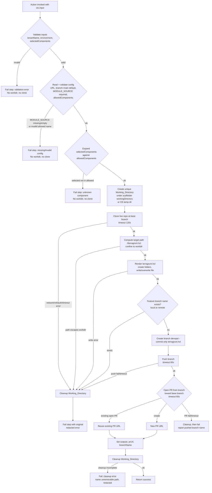

# Design Document

## Overview

This feature implements the `tenant:provision` custom Backstage scaffolder action inside the
already-scaffolded backend module
`@internal/backstage-plugin-platform-backend-module-tenant-provisioning`
(`plugins/platform-backend-module-tenant-provisioning/`). Today that module's `src/module.ts`
only logs `"Hello World!"`. This design replaces that with an action registration that wires a
real provisioning action into the scaffolder, and rewires the existing
`templates/tenant-provisioning/template.yaml` to invoke it in place of the current `debug:log`
placeholder step.

The action performs a strictly bounded workflow: validate inputs and expand the selected components
against the config-driven allowed set → clone the tenant "live" repository at the configured base
branch into a per-execution temporary working directory →
render/create/overwrite `terragrunt.hcl` at `<tenant-name>/<environment>/terragrunt.hcl` →
create a timestamped feature branch → commit only that file → push → open a pull request →
clean up the working directory. The workflow **ends at the pull request**. The action never runs
`terragrunt plan`, `terragrunt apply`, or any Terraform/AWS execution, and does not do so in
tests or CI. This is the hard boundary called out in both the requirements and `AGENTS.md`.

The design addresses all nine requirements: action registration and input/config schema
(Req 1), cloning (Req 2), HCL rendering and file writing (Req 3), branch creation and commit
(Req 4), push and PR creation with idempotency (Req 5), working-directory cleanup (Req 6),
secret protection and tenant isolation (Req 7), fail-fast input validation before side
effects (Req 8), and an extensible, config-driven set of components (Req 9).

### Research notes informing the design

- **Custom action registration in the new backend system.** Backstage's current backend system
  registers scaffolder actions through the `scaffolderActionsExtensionPoint` exported from
  `@backstage/plugin-scaffolder-node/alpha`. A backend module depends on that extension point in
  `registerInit` and calls `scaffolderActions.addActions(myAction)`. The action itself is built
  with `createTemplateAction` from `@backstage/plugin-scaffolder-node`. This is the same
  mechanism the stock `@backstage/plugin-scaffolder-backend-module-github` (already a backend
  dependency) uses, so the module fits the existing `backend.add(import('...'))` wiring in
  `packages/backend/src/index.ts` with no backend-index change beyond what already exists.
  (Sources: Backstage docs — [Writing Custom Actions](https://backstage.io/docs/features/software-templates/writing-custom-actions),
  [Migrating to the New Backend System](https://backstage.io/docs/backend-system/building-backends/migrating). Content rephrased for compliance with licensing restrictions.)
- **Config vs raw env.** `AGENTS.md` and Backstage convention require environment-specific
  values to be `${ENV_VAR}` references in `app-config*.yaml`, read through the config service —
  not `process.env` reads inside code. The action therefore reads a new `tenantProvisioning:`
  config block via `coreServices.rootConfig`. The `${ENV_VAR}` substitution (e.g.
  `${TENANT_LIVE_REPO_URL}`) is resolved by Backstage's config loader, satisfying Requirement 1.9.
- **GitHub auth.** The repo already configures `integrations.github` with `token: ${GITHUB_TOKEN}`.
  The action resolves the token for the live repo host through
  `ScmIntegrations`/`DefaultGithubCredentialsProvider` from `@backstage/integration` rather than
  reading `GITHUB_TOKEN` directly, so the same credential source and host-matching logic used by
  the rest of the app is reused, and the token never appears as a literal in code.
- **Git library choice.** `isomorphic-git` (pure-JS, no `git` CLI dependency) is chosen for the
  local clone/branch/commit/push operations, and Octokit (`@octokit/rest`) for pull-request
  creation. Rationale in Architecture below.
- **Config-driven allowed components + multi-select form.** Requirement 1.10/Req 9 require the
  Allowed_Components to come from app-config, not a hardcoded list, and the template to offer them
  as a selectable set. Backstage Templates use rjsf (react-jsonschema-form) for the parameter UI; a
  JSON-schema `array` property whose `items` declare an `enum` renders as a multi-select, and the
  `ui:widget: checkboxes` annotation renders it as a checkbox list (one box per enum value). The
  selection arrives at the step as a `string[]`, which the action expands against the config list.
  This keeps the authoritative component set in config while the template only mirrors it in its
  `enum`. (Source: Backstage docs — [Writing Templates](https://backstage.io/docs/features/software-templates/writing-templates); rjsf array/enum widgets. Content rephrased for compliance with licensing restrictions.)

## Architecture

The action is a single `createTemplateAction` handler orchestrating four collaborators: a
**ConfigReader** (resolves and validates config), an **HclRenderer** (pure string renderer), a
**GitHelper** (clone/branch/commit/push over isomorphic-git and PR creation over Octokit), and a
**WorkspaceManager** (creates and tears down the per-execution working directory, enforces path
confinement). Input validation runs first, entirely in-process, before any collaborator with a
side effect is touched.

### Module wiring

```
packages/backend/src/index.ts
  └─ backend.add(import('@internal/...-tenant-provisioning'))   // already present
        └─ platformModuleTenantProvisioning (createBackendModule)
              └─ registerInit deps:
                   - scaffolder: scaffolderActionsExtensionPoint  (@backstage/plugin-scaffolder-node/alpha)
                   - config:     coreServices.rootConfig
                   - logger:     coreServices.logger
              └─ init: scaffolder.addActions(createTenantProvisionAction({ config, logger }))
```

The module keeps `pluginId: 'platform'`, `moduleId: 'tenant-provisioning'`. Only the
`registerInit` body changes: it adds the scaffolder extension point and config as deps and
registers the action instead of logging.

### Execution flow (happy path and failure/cleanup path)



Cleanup runs from a `try/finally` wrapping everything after the working directory is created, so
both the success return and every failure branch delete the working directory before the action
returns (Req 6.1, 6.2). Input validation, config validation (including invalid allowed component
names), and component expansion (including unknown selected component names) all run *before* the
working directory is created, so those failures never create one (Req 8.1, 8.4, 9.6, 9.7).

### Git approach and rationale

The action does its own git work rather than delegating to the stock
`publish:github:pull-request` action, because a single custom action must own the full
sequence (clone at a specific base branch, render into an existing repo layout, commit exactly
one file, branch-name and PR idempotency checks) as one atomic step with one cleanup boundary;
chaining stock actions would split that across steps and lose the shared working directory and
the fail-fast/cleanup guarantees.

- **Local git (clone/branch/add/commit/push):** `isomorphic-git`. It is pure JavaScript with a
  Node `fs` and `http` backend, so it needs no `git` CLI on the backend host — consistent with
  `AGENTS.md`'s note that only the *provisioning* (Terragrunt) steps carry a process-execution
  dependency, not this PR-only action. It also exposes explicit `singleBranch`/`ref` clone
  options for cloning only the base branch.
- **Pull request creation:** Octokit (`@octokit/rest`). PR creation and the "already-open PR"
  lookup (Req 5.6) are GitHub REST operations with no local-git equivalent.
- **Auth:** resolved via `ScmIntegrations.fromConfig(rootConfig)` +
  `DefaultGithubCredentialsProvider`, keyed by the live repo URL's host, yielding a token used as
  the isomorphic-git HTTP basic-auth password and the Octokit `auth`. The token is never logged
  and never written to any file (Req 7.1, 7.2).

## Components and Interfaces

### 1. Action factory — `createTenantProvisionAction`

Location: `plugins/platform-backend-module-tenant-provisioning/src/actions/tenantProvision.ts`.

```ts
export function createTenantProvisionAction(options: {
  config: RootConfigService;   // coreServices.rootConfig
  logger: LoggerService;       // coreServices.logger
}): TemplateAction<TenantProvisionInput, TenantProvisionOutput>;
```

Built with `createTemplateAction({ id: 'tenant:provision', schema: { input, output }, handler })`.
The handler receives the scaffolder `ctx` (including `ctx.workspacePath`,
`ctx.logger`, `ctx.output`, and — when configured — the scaffolder working directory via the
action context). The action id is exactly `tenant:provision` (Req 1.1), and registering it via
the extension point makes it available to templates once the backend starts (Req 1.2).

Input schema (zod, enforced by the scaffolder before the handler runs — Req 1.3, 8.2, 8.3):

| Field | Type | Rules | Requirement |
| --- | --- | --- | --- |
| `tenantName` | string | pattern `^[a-z0-9-]{1,32}$`, required | 1.3, 8.2 |
| `environment` | enum | one of `dev`,`test`,`uat`,`prod`, required | 1.3, 8.3 |
| `selectedComponents` | array of strings | the component names the user selected (a subset of the Allowed_Components); default `[]` | 1.3, 1.5, 9.1, 9.6 |

**Component modeling decision.** The action accepts the user's selection as a single
`selectedComponents: string[]` array (the Selected_Components) rather than fixed
`dynamodb`/`ecr` boolean fields or a pre-built boolean map. The **authoritative** list of valid
component names (Allowed_Components) is *not* an input — it is read by the action from app-config
(`tenantProvisioning.components`, see ConfigReader). Inside the handler the action **expands**
`selectedComponents` against the configured Allowed_Components into the internal full
`components: Record<string, boolean>` record (every Allowed_Component present, `true` when it is in
`selectedComponents` and `false` otherwise — see the *Component expansion* note below). That record
is what the HclRenderer consumes.

This split is the cleanest way to satisfy Requirement 9's "extensible set of components without
core-logic changes": the action's input contract is a generic name array, the allowed-set is pure
config, and the renderer is generic over the resulting map, so adding a future component is a
config + template change (extend `tenantProvisioning.components` and the parameter enum) with no
action code change. The alternative — keeping named booleans on the action, or having the template
hardcode the boolean map — was rejected because it reintroduces a hardcoded, per-component list in
the action or template step, which is exactly what Req 9.1/9.2/9.5 aim to avoid.

An empty `selectedComponents` array is valid: expansion yields every Allowed_Component set to
`false` (Req 9.8). A selected name that is not a member of the Allowed_Components is rejected during
expansion, before any file is rendered or written (Req 9.6).

Output schema (Req 5.4):

| Field | Type | Meaning |
| --- | --- | --- |
| `pullRequestUrl` | string | URL of the created or reused PR |
| `branchName` | string | the `devops/...` feature branch that was pushed |

#### Component expansion

Location: `.../src/components.ts`. A pure, deterministic function that turns the user's selection
plus the configured allowed-set into the full boolean record the renderer consumes:

```ts
function expandComponents(
  selected: string[],
  allowed: string[],
): Record<string, boolean>;
```

Behavior:

- Validates that **every** name in `selected` is a member of `allowed`; if any selected name is not
  in the Allowed_Components, it throws an error identifying the unrecognized component, before any
  record is produced or any file is written (Req 9.6).
- Returns a record with **one entry per Allowed_Component**: `{ [name]: selected.includes(name) }`.
  Every allowed name is therefore present, `true` when selected and `false` otherwise (Req 1.5,
  9.1). Duplicate entries in `selected` collapse to a single `true`.
- Is deterministic: the same `(selected, allowed)` pair always produces the same record, so combined
  with the renderer's byte-order sort the whole pipeline is reproducible (Req 9.5).
- An empty `selected` yields every allowed name mapped to `false` (Req 9.8); an empty `allowed`
  yields the empty record `{}` regardless of `selected` (subject to the Req 9.6 membership check,
  which rejects any non-empty selection against an empty allowed-set) (Req 9.9).

Allowed-name pattern/size validation (`^[a-z0-9_]+$`, Req 9.7; count bound) is performed on the
Allowed_Components in the ConfigReader before expansion; `expandComponents` may assume its `allowed`
argument has already been validated, and the renderer re-checks name pattern/size as defense in
depth.

### 2. ConfigReader

Location: `.../src/config.ts`.

```ts
interface TenantProvisioningConfig {
  liveRepoUrl: string;         // tenantProvisioning.liveRepoUrl  <- ${TENANT_LIVE_REPO_URL}
  liveRepoBranch: string;      // tenantProvisioning.liveRepoBranch <- ${TENANT_LIVE_REPO_BRANCH}, default 'main'
  moduleSource: string;        // tenantProvisioning.moduleSource <- ${TERRAGRUNT_MODULE_SOURCE}, required non-empty
  allowedComponents: string[]; // tenantProvisioning.components, default ['dynamodb', 'ecr']
}

function readTenantProvisioningConfig(config: RootConfigService): TenantProvisioningConfig;
```

Reads the `tenantProvisioning` config block. `liveRepoUrl`, `liveRepoBranch`, and `moduleSource`
are read via `config.getOptionalString(...)`; `allowedComponents` is read from the
`tenantProvisioning.components` **list** via `config.getOptionalStringArray('tenantProvisioning.components')`.

- Applies the `main` default for the branch (Req 1.7).
- Throws a config error identifying the missing key when `moduleSource` is absent or empty (Req 1.8).
- Applies the default `['dynamodb', 'ecr']` for `allowedComponents` when
  `tenantProvisioning.components` is not configured, so the Allowed_Components come from
  configuration rather than a hardcoded list in the action's logic (Req 1.10). New components are
  added by extending this config list, with no action code change (Req 9.5).
- Validates that every entry in `allowedComponents` matches `^[a-z0-9_]+$`; any non-matching name
  fails here — before any working directory or clone — with an error identifying the invalid
  component name (Req 9.7). It also rejects an allowed-set larger than the 100-entry bound
  (Req 9.8).

Values come from `${ENV_VAR}` references, never literals (Req 1.9). This runs before any working
directory is created, so a misconfigured allowed-set fails fast with no side effects.

### 3. HclRenderer

Location: `.../src/hcl.ts`. A pure function — no I/O — which makes it directly property-testable.

```ts
function renderTerragruntHcl(input: {
  tenantName: string;
  environment: 'dev' | 'test' | 'uat' | 'prod';
  moduleSource: string;
  components: Record<string, boolean>; // component name -> enabled; e.g. { dynamodb: false, ecr: true }
}): string;
```

The renderer is **data-driven over the `components` map** rather than over a fixed pair of
`enable_dynamodb`/`enable_ecr` fields (Req 9.1). For each entry it emits exactly one
`enable_<name>` line inside the `inputs` block using the *same* rendering logic for every
component, with **no per-component-name branching** (Req 9.2, 9.3). This means new components
(each contributing its own `enable_<component>` input) can be added by the caller without any
change to the rendering logic.

**The renderer does not build the map — the action does.** The full `components` record the
renderer consumes is produced by the action's `expandComponents(selectedComponents, allowedComponents)`
step (see the *Component expansion* note in Component 1), which expands the user's selection against
the config-driven Allowed_Components into a `true`/`false` entry per allowed name. The renderer
stays unaware of which names are "allowed"; it simply renders whatever record it is given. The
authoritative allowed-list membership check (rejecting unknown selected names, Req 9.6) therefore
lives in the action's expansion step, not the renderer.

Determinism and ordering:

- Entries are sorted by component name in **ascending lexicographic byte order** before emission,
  so the same `components` map (same keys and values) always produces byte-for-byte identical
  output (Req 9.5).
- A component whose value is missing/undefined is treated as `false` (Req 9.4).
- An **empty** `components` map yields an `inputs` block containing only `tenant_name` and
  `environment`, with no `enable_<component>` entries (Req 9.7).

Validation (performed by the renderer, or a validation helper it calls, *before* producing any
output — and therefore before any file is written) as **defense in depth**, since the authoritative
allowed-name pattern/size check already ran in the ConfigReader (Req 9.7) and the membership check
in `expandComponents` (Req 9.6):

- Any component name not matching `^[a-z0-9_]+$` is rejected with an error identifying the invalid
  name (Req 9.7).
- A `components` map with more than 100 entries is rejected with a "component count exceeds the
  allowed maximum" error (Req 9.8).

A hand-written string template is used rather than an HCL-generation library: the output shape is
fixed and tiny (an `include` block, a `terraform` block, and an `inputs` block), and
`tenantName`/`environment` are already constrained to `^[a-z0-9-]...` / the enum, so they cannot
contain HCL-breaking characters. Component names are likewise constrained to `^[a-z0-9_]+$`, so
they too cannot break the HCL (no quotes, whitespace, or newlines are possible in a key), and the
boolean values render as the literals `true`/`false`. `moduleSource` comes from trusted operator
config; it is embedded inside a double-quoted HCL string and the renderer rejects any value
containing `"` or newline to keep the output well-formed. This avoids a dependency for a
trivially small, fully-constrained output.

### 4. WorkspaceManager

Location: `.../src/workspace.ts`.

```ts
interface Workspace {
  root: string;                       // absolute path to the per-execution dir
  resolveWithin(relPath: string): string;  // path.resolve + confinement guard
  cleanup(): Promise<void>;           // rm -rf, reports what remains if not fully removed
}

function createWorkspace(opts: {
  baseDir?: string;   // scaffolder workingDirectory if configured, else undefined
  tenantName: string;
  environment: string;
}): Promise<Workspace>;
```

Creates a uniquely named subdirectory (e.g. via `fs.mkdtemp`) under the scaffolder working
directory when configured, otherwise under `os.tmpdir()` (Req 6.4, 6.5). `resolveWithin` resolves
a relative path against `root` and throws if the normalized result is not a descendant of `root`
(Req 3.7, 7.4, 7.5). `cleanup` removes the directory recursively and, if anything remains, throws
an error naming the residual path with all secrets redacted (Req 6.3).

### 5. GitHelper

Location: `.../src/git.ts`. Wraps isomorphic-git and Octokit; the only component that touches the
network.

```ts
interface GitHelper {
  clone(opts: { url: string; ref: string; dir: string; timeoutMs: number }): Promise<void>;
  localBranchOrRemoteExists(branch: string): Promise<boolean>;
  createBranchCommitPush(opts: {
    branch: string; baseBranch: string; filePath: string; message: string; timeoutMs: number;
  }): Promise<void>;
  findOpenPullRequest(opts: { head: string; base: string }): Promise<{ url: string } | undefined>;
  createPullRequest(opts: {
    head: string; base: string; title: string; timeoutMs: number;
  }): Promise<{ url: string }>;
}
```

Timeouts are enforced with `AbortController`/`Promise.race` (clone 120s — Req 2.6; push 60s —
Req 5.7; PR 60s — Req 5.8). All error mapping/redaction (below) is applied here before errors
propagate.

### 6. Template rewiring — `templates/tenant-provisioning/template.yaml`

The two separate `dynamodb`/`ecr` boolean parameters are replaced by a **single multi-select array
parameter** (`components`), and the `show-inputs` `debug:log` step is replaced by a `tenant:provision`
step that forwards that array as `selectedComponents`.

Updated parameter (a checkbox list of component names):

```yaml
  parameters:
    - title: Tenant provisioning inputs
      required:
        - tenantName
        - environment
      properties:
        tenantName:
          title: Tenant name
          type: string
          pattern: '^[a-z0-9-]{1,32}$'
          ui:autofocus: true
        environment:
          title: Environment
          type: string
          enum: [dev, test, uat, prod]
          default: dev
        components:
          title: Components
          description: Optional components to enable for this tenant/environment.
          type: array
          items:
            type: string
            enum: [dynamodb, ecr]
          uniqueItems: true
          default: []
          ui:widget: checkboxes
```

Updated step + output:

```yaml
  steps:
    - id: provision
      name: Provision tenant Terragrunt config
      action: tenant:provision
      input:
        tenantName: ${{ parameters.tenantName }}
        environment: ${{ parameters.environment }}
        selectedComponents: ${{ parameters.components }}

  output:
    links:
      - title: Open pull request
        url: ${{ steps.provision.output.pullRequestUrl }}
    text:
      - title: Provisioning result
        content: |
          - **Tenant name:** ${{ parameters.tenantName }}
          - **Environment:** ${{ parameters.environment }}
          - **Components:** ${{ parameters.components }}
          - **Branch:** ${{ steps.provision.output.branchName }}
          - **Pull request:** ${{ steps.provision.output.pullRequestUrl }}
```

An array property whose `items` carry an `enum` renders in Backstage's rjsf-based form as a
**checkbox list** — one checkbox per enum value — when annotated with `ui:widget: checkboxes`, with
`uniqueItems: true` ensuring each name appears at most once. The user's checked names arrive as a
`string[]`, which the step forwards directly as `selectedComponents` (a single `${{ ... }}`
placeholder resolving to the array value), matching the action's input schema. The action then
expands that array against the config-driven Allowed_Components, so the template never sends a
boolean map and the action never learns component names from a hardcoded list — a future component
is added by extending both the parameter `enum` and `tenantProvisioning.components`, with no action
code change (Req 9.5).

**Ownership note.** The parameter form (field titles, the `tenantName`/`environment` validation, and
the `components` enum) is technically owned by the `tenant-provisioning-template` spec, not this
feature. It is shown here because this feature edits the same `template.yaml` file to rewire the
step; the new `components` parameter shape must line up with the action's `selectedComponents`
contract, so it is documented alongside the step change. The scalar `tenantName`/`environment`
parameters are unchanged in intent.

## Data Models

### Action input (`TenantProvisionInput`)

```ts
type Environment = 'dev' | 'test' | 'uat' | 'prod';

interface TenantProvisionInput {
  tenantName: string;    // ^[a-z0-9-]{1,32}$
  environment: Environment;
  selectedComponents?: string[]; // names the user selected (subset of Allowed_Components); default []
  // The action expands this against the config-driven Allowed_Components
  // (tenantProvisioning.components) into the internal full record
  //   components: Record<string, boolean>  // every allowed name => selectedComponents.includes(name)
  // via expandComponents(); that record is what the HclRenderer consumes.
  // Today the template offers [dynamodb, ecr]; future components extend the config + parameter enum.
}
```

### Action output (`TenantProvisionOutput`)

```ts
interface TenantProvisionOutput {
  pullRequestUrl: string;
  branchName: string;    // devops/<tenant>-<env>-<yyyymmdd-hhmmss>
}
```

### Config shape (`app-config.yaml`, new block)

```yaml
tenantProvisioning:
  liveRepoUrl: ${TENANT_LIVE_REPO_URL}
  liveRepoBranch: ${TENANT_LIVE_REPO_BRANCH} # optional; defaults to main
  moduleSource: ${TERRAGRUNT_MODULE_SOURCE}  # required
  components: [dynamodb, ecr]                # optional Allowed_Components list; defaults to [dynamodb, ecr]
```

Resolved into `TenantProvisioningConfig` (see ConfigReader). The `components` list is the
authoritative Allowed_Components; when omitted it defaults to `[dynamodb, ecr]` (Req 1.10), and each
name must match `^[a-z0-9_]+$` (Req 9.7). A `config.d.ts` schema declaration is added in the module
so `backstage-cli config:check` validates the block.

### Rendered `terragrunt.hcl` shape

```hcl
include "root" {
  path = find_in_parent_folders("root.hcl")
}

terraform {
  source = "<moduleSource>"
}

inputs = {
  tenant_name     = "<tenantName>"
  environment     = "<environment>"
  enable_dynamodb = <true|false>
  enable_ecr      = <true|false>
}
```

The `enable_<component>` lines are **generated per component** from the expanded `components` record
— one line per Allowed_Component — not from fixed fields. The record is produced by expanding the
user's `selectedComponents` against the config-driven Allowed_Components, so **every** allowed
component appears (value `true` when selected, `false` otherwise). Lines are emitted in ascending
lexicographic byte order of the component name, so with today's default allowed-set `[dynamodb, ecr]`
the output is `enable_dynamodb` then `enable_ecr` as shown (each `true`/`false` per what the user
selected); an empty Allowed_Components list produces an `inputs` block with only `tenant_name` and
`environment` (Req 9.3, 9.5, 9.8, 9.9). Written at
`<Working_Directory>/<tenantName>/<environment>/terragrunt.hcl` (Req 3.1–3.4).

### Feature branch name

`devops/<tenantName>-<environment>-<yyyymmdd-hhmmss>`, timestamp in UTC at execution start
(Req 4.2). Matches `^devops/[a-z0-9-]{1,32}-(dev|test|uat|prod)-\d{8}-\d{6}$`.

## Correctness Properties

### Property 1: Rendered HCL round-trips the inputs

*For any* valid tenant name (matching `^[a-z0-9-]{1,32}$`), environment (one of `dev`, `test`,
`uat`, `prod`), module source (a well-formed source string), *for any* set of allowed component
names all matching `^[a-z0-9_]+$` with size 0..100, and *for any* `selectedComponents` array that is
a subset of the allowed set, the pipeline `renderTerragruntHcl(expandComponents(selectedComponents,
allowed), ...)` SHALL produce a `terragrunt.hcl` containing an `include "root"` block, a `terraform`
block whose `source` equals the module source, and an `inputs` block whose `tenant_name` and
`environment` parse back to exactly the provided values and whose `enable_<name>` entries parse back
to exactly one entry per **allowed** component, each with value `true` iff that name is in
`selectedComponents` and `false` otherwise (an empty allowed set yields no `enable_<component>`
entries).

**Validates: Requirements 3.1, 3.2, 3.3, 1.5, 9.1, 9.3, 9.4, 9.8, 9.9**

### Property 2: Feature branch name is well-formed

*For any* valid tenant name and environment and *for any* execution timestamp, the generated
feature branch name SHALL match `^devops/[a-z0-9-]{1,32}-(dev|test|uat|prod)-\d{8}-\d{6}$` and
SHALL embed the tenant name, the environment, and the UTC timestamp components (year, month, day,
hour, minute, second) in that order.

**Validates: Requirements 4.2**

### Property 3: Target path stays confined to the working directory

*For any* input string used to build a repository-relative target path (including inputs
containing `..`, absolute-path prefixes, or separator characters), the resolved target path SHALL
either be a descendant of the working directory root, or be rejected before any file read or write
occurs. No resolved path SHALL escape the working directory.

**Validates: Requirements 3.4, 3.7, 7.4, 7.5**

### Property 4: Invalid input is rejected with no side effects

*For any* input where the tenant name is absent, empty, blank, or violates `^[a-z0-9-]{1,32}$`, or
the environment is not exactly one of `dev`, `test`, `uat`, `prod`, the action SHALL fail with a
validation error identifying the offending input, and SHALL perform no side effect — no working
directory is created, no clone is attempted, and no branch, commit, or pull request is created.

**Validates: Requirements 1.4, 8.1, 8.2, 8.3, 8.4**

### Property 5: Secret redaction is total and content-preserving

*For any* message string and *for any* secret value, redacting the message SHALL replace every
occurrence of the secret value with a fixed non-reversible placeholder, SHALL leave a message that
contains no occurrence of the secret value, and SHALL leave all non-secret substrings unchanged.

**Validates: Requirements 7.3, 7.1**

### Property 6: Working directories are unique per execution

*For any* two distinct executions (whether the scaffolder working directory is configured or the
OS temp directory is used), the two created working-directory paths SHALL be distinct, so that one
execution's file operations cannot collide with another's.

**Validates: Requirements 6.4, 6.5**

### Property 7: Pull request title identifies tenant and environment

*For any* valid tenant name and environment, the generated pull request title SHALL contain both
the tenant name and the environment.

**Validates: Requirements 5.3**

### Property 8: Component rendering is data-driven, ordered, and validated

*For any* `components` map whose keys all match `^[a-z0-9_]+$` and whose size is 0..100,
`renderTerragruntHcl` SHALL emit exactly one `enable_<key>` line per entry, ordered by key in
ascending lexicographic byte order, with the boolean value matching the map, using the same
rendering logic for every key with no component-name-specific branching; and *for any* map
containing a key not matching `^[a-z0-9_]+$` or whose size exceeds 100, rendering SHALL fail with an
error identifying the violation before producing any output.

**Validates: Requirements 9.2, 9.3, 9.4, 9.7, 9.8**

### Property 9: Component expansion is total over the allowed set and rejects unknown selections

*For any* set of allowed component names and *for any* `selectedComponents` array that is a subset
of that allowed set, `expandComponents(selectedComponents, allowed)` SHALL return a record with
exactly one entry per allowed name, whose value is `true` iff that name is in `selectedComponents`
and `false` otherwise (so an empty selection yields every allowed name mapped to `false`, and an
empty allowed set yields the empty record); and *for any* `selectedComponents` array containing a
name that is not a member of the allowed set, `expandComponents` SHALL fail with an error
identifying the unrecognized component before producing any record.

**Validates: Requirements 9.1, 9.5, 9.6, 9.8, 9.9**

## Error Handling

All errors are raised so the scaffolder marks the step failed. Every error passes through the
GitHelper/action redaction layer (Property 5) before it is logged or returned, so no `GITHUB_TOKEN`
or AWS credential value can appear in any message, stack trace, or exception detail (Req 7.1, 7.3).
Cleanup of the working directory runs in a `finally` block, so the redacted failure is surfaced
*after* the directory is removed (Req 6.2).

| Condition | Requirement | Handling |
| --- | --- | --- |
| Tenant name absent/empty/blank or invalid pattern | 1.4, 8.1, 8.2, 8.4 | Fail during input validation, before any workspace/clone; error names the tenant input. |
| Environment absent or not in enum | 1.4, 8.1, 8.3, 8.4 | Fail during input validation, before any workspace/clone; error names the environment input. |
| `TERRAGRUNT_MODULE_SOURCE` absent/empty | 1.8 | Fail in ConfigReader, before any workspace/clone; error names the missing config key. |
| Allowed component name (from `tenantProvisioning.components`) does not match `^[a-z0-9_]+$` | 9.7 | Fail in ConfigReader, before any workspace/clone; error identifies the invalid allowed component name; no Terragrunt_File rendered or written. |
| Allowed_Components list has more than 100 entries | 9.8 | Fail in ConfigReader (and re-checked by the renderer as defense in depth), before any file write; error indicates the component count exceeds the allowed maximum; no Terragrunt_File rendered or written. |
| Selected component name is not a member of the Allowed_Components | 9.6 | Fail during `expandComponents`, before any file write; error identifies the unrecognized component; no Terragrunt_File rendered or written. |
| Clone: repo unreachable (network) | 2.3 | Fail with "repository could not be reached" error; cleanup runs. |
| Clone: base ref missing | 2.4 | Fail with error identifying the missing ref; cleanup runs. |
| Clone: auth rejected | 2.5 | Fail with an authentication error with the token redacted; cleanup runs. |
| Clone: exceeds 120s | 2.6 | Abort via `AbortController`, fail with "clone timed out"; cleanup runs. |
| Target path escapes working directory | 3.7, 7.5 | Abort before any file I/O, fail with a path-confinement error; no file created/modified. |
| Folder create / file write fails | 3.8 | Fail with "file could not be written"; any pre-existing file content left unchanged; cleanup runs. |
| Feature branch already exists (local or remote) | 4.4 | Fail with "branch name already exists"; no commit or PR created; cleanup runs. |
| Push rejected or exceeds 60s | 5.7 | Fail with a push-failure error; no PR attempted; cleanup runs. |
| PR creation fails or exceeds 60s | 5.8 | Fail with a PR-failure error reporting the pushed branch name; cleanup runs. |
| Open PR from branch→base already exists | 5.6 | Not an error: reuse the existing PR URL as output; no duplicate created. |
| Cleanup does not fully remove working directory | 6.3 | Return a cleanup error naming the residual path, with secrets redacted. |

## Testing Strategy

Testing follows a dual approach: **property-based tests** for the pure, input-varying logic
(Properties 1–9) and **mock-based unit/integration tests** for the git/network workflow and error
mapping. Tests run under the repo's existing `backstage-cli`/Jest setup
(`yarn workspace @internal/backstage-plugin-platform-backend-module-tenant-provisioning test`).
**No test runs `terragrunt`/`terraform` or any AWS/network operation** — all git and Octokit calls
are mocked, honoring the hard boundary in Requirement 5.5 and `AGENTS.md`.

Property-based testing applies to this feature's **pure, input-varying logic**: HCL rendering,
component expansion, branch-name formatting, target-path derivation/confinement, input validation,
secret redaction, and working-directory uniqueness. It does **not** apply to the git/network I/O, PR
idempotency, or scaffolder wiring — those are covered by the mock-based unit and integration tests
below. The correctness properties were derived from the prework analysis, with redundant criteria
consolidated: Requirements 3.1–3.3 and 1.5 collapse into a single rendering check; 3.4/3.7/7.4/7.5
into a single path-confinement check; and 8.1–8.4 and 1.4 into a single validation check. The
extensible-component behavior (Req 9) is covered by Property 1 (the full expand→render pipeline
round-trips selected-against-allowed), Property 8 (renderer ordering, defaulting, and name/size
validation), and Property 9 (the `expandComponents` totality and unknown-selection rejection), all
exercised with `fast-check` generators over arbitrary allowed-sets and selection subsets.

### Property-based tests

The backend workspace already declares `fast-check@^4.9.0`; the module adds `fast-check` as a
devDependency via `yarn workspace @internal/backstage-plugin-platform-backend-module-tenant-provisioning add -D fast-check`
(never by hand-editing `package.json`, per `AGENTS.md`). Property-based testing is **not**
implemented from scratch — `fast-check` provides the generators and shrinking.

Each property test:
- runs a minimum of **100 iterations** (`fc.assert(..., { numRuns: 100 })`);
- is tagged with a comment referencing its design property in the format
  `Feature: tenant-provision-action, Property N: <property text>`;
- targets pure functions (`renderTerragruntHcl` and its component-name/count validation, the
  branch-name builder, `resolveWithin`, the input validator, `expandComponents`, the redaction
  helper, the workspace path builder, the PR-title builder) with no I/O.

Property → test mapping:

- **Property 1** — generator over `{tenantName, environment, moduleSource, allowed, selected}` where
  `allowed` is an arbitrary set of valid names (`^[a-z0-9_]+$`, 0..100 entries) and `selected` is a
  subset of `allowed`; run `renderTerragruntHcl(expandComponents(selected, allowed), ...)`, then
  parse `terraform.source`, `inputs.tenant_name/environment`, and each `inputs.enable_<name>` back
  out and assert equality — exactly one entry per allowed name, `true` iff in `selected` (an empty
  allowed set yields no `enable_<component>` entries). Tag: `Feature: tenant-provision-action,
  Property 1: Rendered HCL round-trips the inputs`.
- **Property 2** — generator over valid tenant/env plus arbitrary `Date`; assert the branch name
  matches the regex and embeds the UTC components. Tag: `... Property 2: Feature branch name is
  well-formed`.
- **Property 3** — generator over arbitrary strings (biased toward `..`, `/`, absolute prefixes);
  assert `resolveWithin` output is inside root or throws. Tag: `... Property 3: Target path stays
  confined to the working directory`.
- **Property 4** — generator over invalid tenant/env strings; assert the validator throws and (with
  a spy on the workspace/git collaborators) that none were invoked. Tag: `... Property 4: Invalid
  input is rejected with no side effects`.
- **Property 5** — generator over a message string and a secret value (secret injected at random
  positions); assert redaction removes all occurrences and preserves the rest. Tag: `... Property
  5: Secret redaction is total and content-preserving`.
- **Property 6** — invoke the workspace path builder many times and assert all generated paths are
  distinct. Tag: `... Property 6: Working directories are unique per execution`.
- **Property 7** — generator over valid tenant/env; assert the PR title contains both. Tag: `...
  Property 7: Pull request title identifies tenant and environment`.
- **Property 8** — generator over arbitrary `components` maps with valid keys (`^[a-z0-9_]+$`,
  0..100 entries): assert the rendered output has exactly one `enable_<key>` line per entry, that
  the lines appear in ascending byte order of key, and that each value matches the map; plus
  generators biased toward **invalid keys** (containing uppercase, hyphens, dots, or whitespace) and
  **oversized maps** (>100 entries): assert `renderTerragruntHcl` throws before producing output.
  Tag: `... Property 8: Component rendering is data-driven, ordered, and validated`.
- **Property 9** — generator over an arbitrary `allowed` set plus a `selected` subset: assert
  `expandComponents(selected, allowed)` returns a record with exactly one entry per allowed name,
  `true` iff in `selected` (empty selection → all `false`; empty allowed → `{}`); plus a generator
  that injects at least one name **not** in `allowed`: assert `expandComponents` throws identifying
  the unrecognized component before producing a record. Tag: `... Property 9: Component expansion is
  total over the allowed set and rejects unknown selections`.

### Unit and integration tests (mocked)

Example-based tests, using `@backstage/backend-test-utils` and mocked `isomorphic-git`/Octokit,
cover behavior not suited to PBT:

- Config defaults: branch defaults to `main` (Req 1.7); missing `moduleSource` fails before clone
  (Req 1.8); `allowedComponents` defaults to `[dynamodb, ecr]` when `tenantProvisioning.components`
  is absent (Req 1.10); an allowed name violating `^[a-z0-9_]+$` fails in ConfigReader before clone
  (Req 9.7).
- Clone error mapping: network, missing ref, auth-rejected (token redacted), timeout (Req 2.3–2.6).
- File write: creates missing folders and file (Req 3.5); overwrites existing file (Req 3.6); write
  failure leaves prior content intact (Req 3.8).
- Commit contains exactly the `terragrunt.hcl` and a message with tenant+env (Req 4.3); duplicate
  branch fails with no commit/PR (Req 4.4).
- Push then PR happy path exposes `pullRequestUrl` + `branchName` outputs (Req 5.1–5.4); duplicate
  open PR reuses the URL (Req 5.6); push failure/timeout skips PR (Req 5.7); PR failure/timeout
  reports the pushed branch (Req 5.8).
- **Safety assertion (Req 5.5):** a test asserts that no child-process/exec, no `terragrunt`/
  `terraform` invocation, and no AWS call is made anywhere in the action.
- Cleanup: working directory removed on success (Req 6.1) and on failure (Req 6.2); cleanup failure
  yields a redacted error naming the residual path (Req 6.3).
- Registration smoke test: the module registers an action with id `tenant:provision` and it is
  retrievable from the scaffolder actions registry (Req 1.1, 1.2).
- Secret hygiene: log capture across a full mocked run contains no token value (Req 7.1); the
  rendered/committed file never contains a token (Req 7.2).
