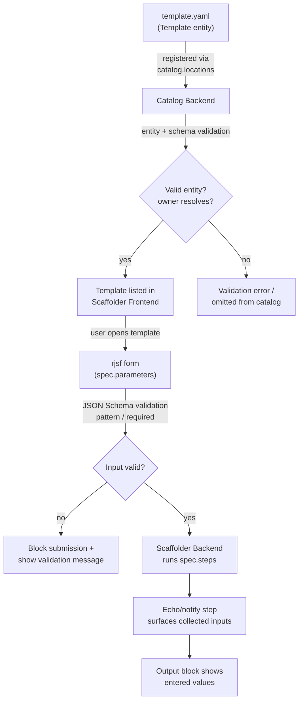

# Design Document

## Overview

This feature adds a Backstage Software Template — a `Template` catalog entity conforming to
`scaffolder.backstage.io/v1beta3` — that provides the **frontend input experience** for tenant
provisioning. The template defines an input form (`spec.parameters`) with validation and defaults
that collect the values a future provisioning action will map to a Terragrunt `inputs` block:
tenant name, environment, and which optional components (`dynamodb`, `ecr`) to enable.

### Scope

**In scope (this feature):**

- A single `Template` catalog entity YAML file.
- The parameter form definition: fields, JSON Schema constraints (required, pattern,
  defaults), titles/descriptions, and UI hints.
- Registration of the template's location under `catalog.locations` for local dev.
- A minimal, executable `steps` section that surfaces the collected inputs back to the user so the
  template is runnable and the entered values are visible — nothing more.

**Explicitly out of scope (future work):**

- Invoking any custom scaffolder action (the `platform` tenant-provisioning backend module).
- Rendering `terragrunt.hcl` from the inputs.
- Cloning/updating the tenant live repository, committing, or opening a chore PR.
- Any Git/Terragrunt/Terraform/AWS side effects.

The design therefore does not add any backend module, npm dependency, or process-execution
dependency. It is a declarative catalog entity plus a config-locations registration.

### Key design decisions

| Decision | Choice | Rationale |
| --- | --- | --- |
| Artifact type | `Template` entity YAML | Matches Requirement 1 and repo convention (`templates/template/template.yaml`). |
| File location | `templates/tenant-provisioning/template.yaml` | Mirrors the existing starter template's folder-per-template layout; keeps demo/starter templates side by side. |
| Local registration | Add a `catalog.locations` file entry in `app-config.yaml` with `rules: allow: [Template]` | Same pattern the existing example template uses; targets are relative to `packages/backend`. |
| Validation mechanism | JSON Schema on `spec.parameters` (required / pattern) | Backstage's frontend uses react-jsonschema-form (rjsf); schema constraints drive form validation and block submission with no custom code. |
| Steps | A single no-side-effect step that echoes the collected inputs (plus an `output` block) | Keeps the template runnable and "shows the values on the UI" as requested, without invoking provisioning. A comment documents this as a placeholder for the future action. |
| Owner | `user:guest` | Matches the repo's existing convention (`org.yaml` defines `guest`, the example template uses `user:guest`), so the owner reference resolves in local dev. |

### Research notes

- **Template shape** — Confirmed against the existing `templates/template/template.yaml`:
  `apiVersion: scaffolder.backstage.io/v1beta3`, `kind: Template`, `metadata` (name/title/
  description), `spec` (owner, type, parameters, steps, output). Parameters are grouped into
  form "pages" (array of objects, each with `title`, `required`, `properties`). UI hints such as
  `ui:field`, `ui:autofocus`, and `ui:options` are used inline on properties.
- **Frontend validation** — Backstage renders `spec.parameters` with react-jsonschema-form. Standard
  JSON Schema keywords (`required`, `pattern`, `minLength`, `maxLength`, `type`, `default`) are
  enforced client-side: invalid input blocks the "Next"/"Review" transition and shows a validation
  message. A `string` property with a `pattern` renders as a plain text input that must match the
  regex; a `boolean` property renders as a checkbox. No custom validator is needed for the
  constraints in the requirements.
- **Constraints mirror Terraform** — The parameter constraints deliberately mirror the tenant
  Terraform module's variable validation, which is the authoritative source of truth: `tenant_name`
  is 1 to 32 characters, `environment` is 1 to 12 characters, both restricted to `^[a-z0-9-]+$`
  (lowercase letters, digits, hyphens) and neither may be empty or whitespace-only. Because a
  whitespace character is not a member of `[a-z0-9-]`, an anchored pattern rejects any
  whitespace-only value automatically (no separate trim/whitespace rule is needed). `environment`
  is a free-text validated string, not an enum, so it renders as a text field rather than a
  dropdown.
- **Local registration pattern** — Confirmed in `app-config.yaml`: `catalog.locations` entries use
  `type: file`, `target` relative to the backend process (`../../templates/...`), and the template
  entry adds `rules: - allow: [Template]`. An unregistered location is simply never ingested, so
  the template is omitted from the catalog (Requirement 1.8).
- **Owner resolution** — `templates/org.yaml` provides the `guest` user/group used by the existing
  template's `user:guest` owner, so reusing `user:guest` keeps the reference resolvable
  (Requirement 1.6).

## Architecture

This feature has no runtime code path of its own. The "architecture" is the flow of a declarative
entity through Backstage's stock catalog and scaffolder subsystems.



Boundaries:

- **Our artifact:** `template.yaml` and the `catalog.locations` entry.
- **Stock Backstage (not modified):** catalog ingestion/validation, scaffolder frontend (rjsf),
  scaffolder backend step execution, `notification:send`/`debug:log` actions.

## Components and Interfaces

### Component 1: Template catalog entity

**File:** `templates/tenant-provisioning/template.yaml`

Top-level structure:

```yaml
apiVersion: scaffolder.backstage.io/v1beta3
kind: Template
metadata:
  name: tenant-provisioning-template
  title: Tenant Provisioning
  description: >-
    Collect the inputs needed to provision or update a tenant's Terragrunt
    configuration (tenant name, environment, and optional components).
spec:
  owner: user:guest
  type: service
  parameters: [ ... ]   # see Component 2
  steps: [ ... ]        # see Component 3
  output: { ... }       # see Component 3
```

This satisfies Requirement 1.1–1.5 (kind/apiVersion, name, non-empty title/description, type
`service`, owner reference).

### Component 2: Parameter form (`spec.parameters`)

The form is a single page (one object in the `parameters` array) titled e.g. "Tenant provisioning
inputs", with a `required` list and a `properties` map. (A single page keeps the four related
inputs together; splitting into multiple pages is unnecessary for four fields.)

```yaml
parameters:
  - title: Tenant provisioning inputs
    required:
      - tenantName
      - environment
    properties:
      tenantName:
        title: Tenant name
        type: string
        description: >-
          Identifier for the tenant (e.g. sampletenant). Used as the tenant's
          top-level folder name and written to the tenant_name Terragrunt input.
          Must be 1-32 characters of lowercase letters, digits, and hyphens.
        pattern: '^[a-z0-9-]{1,32}$'
        ui:autofocus: true
      environment:
        title: Environment
        type: string
        description: >-
          Deployment environment for this tenant configuration. Used as the
          subfolder name and written to the environment Terragrunt input.
          Must be 1-12 characters of lowercase letters, digits, and hyphens.
        pattern: '^[a-z0-9-]{1,12}$'
        default: dev
      dynamodb:
        title: Enable DynamoDB
        type: boolean
        description: Provision the DynamoDB component for this tenant/environment.
        default: false
      ecr:
        title: Enable ECR
        type: boolean
        description: Provision the ECR (container registry) component for this tenant/environment.
        default: false
```

Field-by-field mapping to requirements:

| Field | Type | Constraints | UI behavior | Requirements |
| --- | --- | --- | --- | --- |
| `tenantName` | string | `required`; `pattern: ^[a-z0-9-]{1,32}$` | text input, autofocused | 2.1–2.7 |
| `environment` | string | `required`; `pattern: ^[a-z0-9-]{1,12}$`; `default: dev` | text input | 3.1–3.9 |
| `dynamodb` | boolean | `default: false` | checkbox | 4.1, 4.3, 4.5 |
| `ecr` | boolean | `default: false` | checkbox | 4.2, 4.4, 4.5 |

Notes:

- The single pattern `^[a-z0-9-]{1,32}$` simultaneously enforces the length range (1–32) and the
  allowed character set `[a-z0-9-]`, so empty input, too-long input, and disallowed characters are
  all rejected by one constraint (2.3, 2.4, 2.5, 2.6). The anchors (`^`/`$`) ensure the whole value
  must match; because a whitespace character is not in `[a-z0-9-]`, a whitespace-only value fails the
  pattern (2.7).
- `environment` is a plain `string` with a `pattern` (not an `enum`), so rjsf renders it as a text
  input; the pattern `^[a-z0-9-]{1,12}$` enforces length 1–12 and the allowed character set (3.4).
  Marking it `required` blocks submission when it is empty (3.5), and — as with `tenantName` — a
  whitespace-only value fails the pattern because whitespace is not in `[a-z0-9-]` (3.6). Values
  longer than 12 characters (3.7) or containing disallowed characters (3.8) fail the pattern.
  `default: dev` pre-fills `dev` (3.9), and rendering as a text input satisfies 3.3.
- Each boolean has a non-empty `title` and `description`, satisfying the labeling requirement (4.5),
  and renders as a checkbox with `default: false` (4.3, 4.4).

### Component 3: Executable steps and output

Because no provisioning action is in scope, the template still needs to be **runnable** so the user
can submit the form and see their inputs. We use a single stock step that surfaces the collected
values, plus an `output` block that displays them on the results screen.

```yaml
steps:
  # Placeholder for the future tenant-provisioning scaffolder action.
  # For now this template only collects and echoes input; it does NOT render
  # terragrunt.hcl or open a PR.
  - id: show-inputs
    name: Show collected inputs
    action: debug:log
    input:
      message: >-
        Tenant provisioning inputs collected -
        tenant: ${{ parameters.tenantName }},
        environment: ${{ parameters.environment }},
        dynamodb: ${{ parameters.dynamodb }},
        ecr: ${{ parameters.ecr }}

output:
  text:
    - title: Collected inputs
      content: |
        - **Tenant name:** ${{ parameters.tenantName }}
        - **Environment:** ${{ parameters.environment }}
        - **Enable DynamoDB:** ${{ parameters.dynamodb }}
        - **Enable ECR:** ${{ parameters.ecr }}
```

**Tradeoff — `debug:log` vs `notification:send` vs empty steps:**

- `debug:log` (chosen): a stock scaffolder action, always available, no side effects, no recipients
  or entity refs to configure. It writes the collected values to the task log, and the `output.text`
  block renders them on the UI. Simplest way to make the template runnable and "show the values".
- `notification:send` (as in the starter template): also viable and produces a user-facing
  notification, but requires `recipients`/`entityRefs` wiring and depends on the notifications
  plugin; heavier than needed for an input-only template.
- Empty `steps`: a Template with no steps is effectively not executable/meaningful; it would show
  the form but do nothing on submit, giving the user no confirmation of their input.

The `show-inputs` step is a clearly-commented placeholder that the future provisioning action will
replace. It performs no Git/Terragrunt/Terraform/AWS operation, consistent with the safety guidance
around `apply`-style operations.

### Component 4: Catalog location registration

Add an entry under `catalog.locations` in `app-config.yaml` (local dev), following the existing
example-template pattern (target relative to `packages/backend`):

```yaml
catalog:
  locations:
    # ... existing entries ...
    - type: file
      target: ../../templates/tenant-provisioning/template.yaml
      rules:
        - allow: [Template]
```

This satisfies Requirement 1.7 (registered → listed). Not adding this entry (or removing it) means
the entity is never ingested, so it is omitted from the catalog (1.8). Production registration
(`app-config.production.yaml`) is out of scope for this feature and would point at a real location.

## Data Models

There is no persistent data model. The relevant "data" is the shape of the entity and the parameter
schema.

### Template entity (conceptual shape)

```
Template
├── apiVersion: "scaffolder.backstage.io/v1beta3"
├── kind: "Template"
├── metadata
│   ├── name: "tenant-provisioning-template"
│   ├── title: string (non-empty)
│   └── description: string (non-empty)
└── spec
    ├── owner: string (entity ref, e.g. "user:guest")
    ├── type: "service"
    ├── parameters: FormPage[]
    ├── steps: Step[]
    └── output: { text: [...] }
```

### Parameter input values (collected form data)

| Key | Type | Allowed values | Default | Maps to future Terragrunt input |
| --- | --- | --- | --- | --- |
| `tenantName` | string | matches `^[a-z0-9-]{1,32}$` | (none, required) | `tenant_name` |
| `environment` | string | matches `^[a-z0-9-]{1,12}$` | `dev` | `environment` |
| `dynamodb` | boolean | `true` \| `false` | `false` | `enable_dynamodb` |
| `ecr` | boolean | `true` \| `false` | `false` | `enable_ecr` |

The mapping to Terragrunt inputs is documented for context only; producing that `inputs` block is
future work.

## Correctness Properties

*A property is a characteristic or behavior that should hold true across all valid executions of a
system — essentially, a formal statement about what the system should do. Properties serve as the
bridge between human-readable specifications and machine-verifiable correctness guarantees.*

Most of this feature's acceptance criteria are either (a) deterministic structural facts about a
single YAML artifact (name, type, defaults, presence of titles/descriptions) — best covered by
schema-validation and example/snapshot tests — or (b) Backstage framework/ingestion behavior
(catalog listing, owner resolution, schema-failure omission) — best covered by config-wiring and
integration checks. Those are **not** amenable to property-based testing.

Two criteria groups *do* express universal input/output rules over the parameter JSON Schema and are
therefore expressed as properties below. Each is validated by running candidate values through the
template's own parameter schema (the same schema rjsf uses in the frontend).

### Property 1: Tenant name schema accepts exactly the valid names

*For all* strings `s`, validating `s` against the `tenantName` parameter schema succeeds *if and only
if* `s` has length between 1 and 32 inclusive and every character of `s` is in the set
`a–z`, `0–9`, `-`. In particular, the empty string, any whitespace-only string, any string longer
than 32 characters, and any string containing a character outside that set are rejected.

**Validates: Requirements 2.3, 2.4, 2.5, 2.6, 2.7**

### Property 2: Environment schema accepts exactly the valid values

*For all* strings `v`, validating `v` against the `environment` parameter schema succeeds *if and only
if* `v` has length between 1 and 12 inclusive and every character of `v` is in the set
`a–z`, `0–9`, `-`. In particular, the empty string, any whitespace-only string, any string longer
than 12 characters, and any string containing a character outside that set are rejected.

**Validates: Requirements 3.4, 3.5, 3.6, 3.7, 3.8**

## Error Handling

| Error condition | Where handled | Behavior | Requirement |
| --- | --- | --- | --- |
| `tenantName` empty | rjsf frontend (`required` + pattern min length 1) | Submission blocked; message indicates tenant name is required. | 2.3 |
| `tenantName` whitespace-only | rjsf frontend (pattern char set) | Submission blocked; message indicates tenant name is required. | 2.7 |
| `tenantName` too short/long (outside 1–32) | rjsf frontend (pattern length) | Submission blocked; message indicates allowed length range of 1 to 32 characters. | 2.5 |
| `tenantName` bad characters | rjsf frontend (pattern char set) | Submission blocked; message describes allowed characters. | 2.6 |
| `environment` empty | rjsf frontend (`required` + pattern min length 1) | Submission blocked; message indicates environment is required. | 3.5 |
| `environment` whitespace-only | rjsf frontend (pattern char set) | Submission blocked; message indicates environment is required. | 3.6 |
| `environment` too long (>12) | rjsf frontend (pattern length) | Submission blocked; message states the allowed length range of 1 to 12 characters. | 3.7 |
| `environment` bad characters | rjsf frontend (pattern char set) | Submission blocked; message describes allowed characters. | 3.8 |
| Owner does not resolve | Catalog backend | Entity reported with unresolved owner reference. | 1.6 |
| Location not registered | Catalog backend | Entity never ingested; omitted from the template catalog. | 1.8 |
| Entity fails schema validation | Catalog/scaffolder backend | Validation error reported; template omitted from catalog. | 1.9 |

Validation messaging text is produced by rjsf/Backstage from the schema keywords; we do not author
custom messages. The design's responsibility is to declare the correct constraints so the framework
blocks invalid input.

## Testing Strategy

This feature is primarily a declarative catalog entity plus a config-locations registration, so the
testing strategy is a combination of **entity/schema validation**, **example (structural) unit
tests**, and **two property-based tests** over the parameter JSON Schema. There is no runtime code
module to unit-test beyond loading and validating the YAML.

### Test artifact loading

Tests load `templates/tenant-provisioning/template.yaml`, parse it (YAML → object), and:

1. Run it through Backstage template-entity schema validation to confirm it is a valid
   `scaffolder.backstage.io/v1beta3` `Template` (Requirement 1.1, 1.9 positive case).
2. Extract the `spec.parameters` properties for the structural and property tests below.

### Example / structural unit tests (deterministic, single-artifact facts)

One assertion per criterion; these do not vary with input and are best as example tests (or a
snapshot of the parsed parameter schema):

- `apiVersion === 'scaffolder.backstage.io/v1beta3'`, `kind === 'Template'` (1.1)
- `metadata.name === 'tenant-provisioning-template'` (1.2)
- `metadata.title` and `metadata.description` non-empty (1.3)
- `spec.type === 'service'` (1.4)
- `spec.owner` is a non-empty entity reference (1.5)
- `tenantName.type === 'string'`, `tenantName.pattern === '^[a-z0-9-]{1,32}$'`, and `tenantName` in
  `required` (2.1, 2.4); non-empty title/description (2.2)
- `environment.type === 'string'`, `environment.pattern === '^[a-z0-9-]{1,12}$'`, `environment` in
  `required` (3.1, 3.4, 3.5 presence part), and `environment.default === 'dev'` (3.9); non-empty
  title/description (3.2)
- `dynamodb.type === 'boolean'` (4.1), `dynamodb.default === false` (4.3), non-empty
  title/description (4.5)
- `ecr.type === 'boolean'` (4.2), `ecr.default === false` (4.4), non-empty title/description (4.5)

### Property-based tests (universal input rules)

Use a property-based testing library appropriate for the repo's toolchain — since this is a
Backstage TypeScript monorepo using `backstage-cli repo test` (Jest), use
[`fast-check`](https://github.com/dubzzz/fast-check) with Jest. Do **not** hand-roll random
generation. Each property test:

- Runs a minimum of **100 iterations**.
- Validates candidate values against the actual `tenantName` / `environment` sub-schema extracted
  from the loaded template (e.g. via an `ajv` instance, matching JSON Schema semantics), so the test
  exercises the real committed constraint rather than a copy.
- Is tagged with a comment referencing the design property, using the format:
  `Feature: tenant-provisioning-template, Property {number}: {property_text}`.

Property tests to implement:

- **Property 1 (tenant name):** Generate strings from a mix of generators — arbitrary unicode
  strings, strings drawn only from the allowed alphabet `[a-z0-9-]` with lengths across `0..40`,
  whitespace-only strings, and strings containing at least one disallowed character. Assert schema
  validation succeeds iff length ∈ `[1,32]` and all characters are in `[a-z0-9-]`. This covers
  acceptance (2.4), empty (2.3), whitespace-only (2.7), too-long (2.5), and disallowed characters
  (2.6).
- **Property 2 (environment):** Generate strings from the same mix of generators — arbitrary unicode
  strings, allowed-alphabet `[a-z0-9-]` strings with lengths across `0..20`, whitespace-only
  strings, and strings containing at least one disallowed character. Assert schema validation
  succeeds iff length ∈ `[1,12]` and all characters are in `[a-z0-9-]`. This covers empty (3.5),
  whitespace-only (3.6), too-long (3.7), and disallowed characters (3.8).

### Integration / config-wiring checks (framework behavior, not PBT)

These verify Backstage's own behavior and configuration wiring; use 1–3 examples or manual/e2e
verification rather than property tests:

- `app-config.yaml` `catalog.locations` includes
  `../../templates/tenant-provisioning/template.yaml` with `rules: allow: [Template]`, and the
  template appears in the scaffolder catalog (1.7); absent registration → omitted (1.8).
- The `spec.owner` (`user:guest`) resolves against `templates/org.yaml` so no unresolved-owner error
  is reported (1.6).
- A deliberately malformed copy of the entity fails schema validation and is omitted (1.9 negative
  branch) — optional, low priority, exercises framework behavior.

### Why not property-based testing for the rest

Per the PBT applicability guidance: structural facts (fixed name/type/defaults, presence of
titles/descriptions) do not vary with input, so 100 iterations add no value over a single assertion;
and catalog ingestion, owner resolution, text-input/checkbox rendering, and schema-failure omission are
Backstage framework/infrastructure behaviors, not our own logic. Those are covered by example,
snapshot, and integration tests instead.
